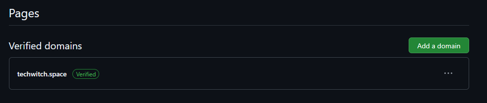
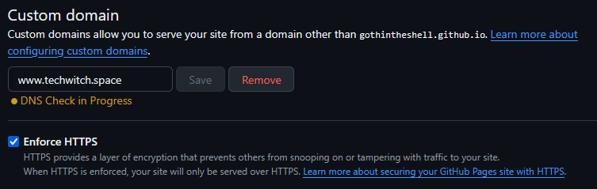

+++
date = '2025-07-18T19:43:37+01:00'
title = 'Setting up my GitHub Pages deployment and custom domain: It is always DNS (my fears)'
author = 'gothintheshell'
draft = false
+++

# Decisions, Decisions

When working with Hugo you have a wide variety of options when it comes to where you want to [host] and how you want deploy your website. 🚀 

In my case I've chosen to host my blog using GitHub Pages and given my familiarity with GitHub Actions workflows, I've chosen that for the deployment using Hugo’s default workflow. If you’re using GitHub Pages and it’s your first time, or just need a refresher, [Hugo's] Host on GitHub Pages docs are straight forward and easy to follow, as long as you are familiar with [creating a new GitHub repository] and pushing the code you've created locally to that repository. 

*If you're not familiar with pushing your local code to GitHub, GitHub has [docs] to get you started. You can chose to utilise the GitHub CLI (command line) or as I wrote about in my [getting started] post, I utilise GitHub Desktop (and there's nothing wrong with that!)*

<iframe src="https://giphy.com/embed/XBWoLDamWHkjOfQKvC" width="100%" height="100%" style="position:absolute" frameBorder="0" class="giphy-embed" allowFullScreen></iframe>

## A quick note on why I chose GitHub Pages: 
* As I’m already using GitHub as a place to store my code, I can quickly deploy my site using GitHub Actions, and Hugo already offers a [default workflow]. Plus there’s flexibility for adding more Actions as I go along. *For those of you who are new to GitHub Actions, these are configurable workflows to support all kinds of automation, including testing, builds, deployments and security checks.*
* It’s **free**, including the use of a custom domain (as long as your repo is public!) If you want to use a custom domain, you will need to have already purchased the domain from a domain registrar and prices can vary based on type of domain (eg. `.com` , `.space`,  `.tech`  or really any of the available top-level domains available) and registrar, but GitHub also offers a free, default subdomain which includes your GitHub user (or organisation) account name, such as `m-pent.github.io`, if you'd like to use that instead . 💅
* It’s a great way to start small, but noting it does have its [limits] so if you want to use it for commercial purposes or have a large audience already, this is not the service for you. 

# Setting up my custom domain to use with GitHub Pages

The documentation for GitHub Pages was successful in guiding me through setting up my custom domain and subdomain. All it took was a bit of patience, as some of these steps require time for the DNS changes to propagate globally, which can normally take up to 24 hours (for each of the DNS changes) or around 48-72 hours total. 

>  One quick word of advice, ***making DNS changes can have a significant impact on existing websites and services***, so if this is not a brand new domain (eg. you already have website, SSL certificates, or other services using the domain) please be aware of this ahead of making any changes and backup any information you want to ensure you have access to (just in case!) It doesn’t have to be scary (okay maybe it’s a little bit scary) but it’s something you can learn to do! 

<iframe src="https://giphy.com/embed/3orieVD6OthPoFXjrO" width="100%" height="100%" style="position:absolute" frameBorder="0" class="giphy-embed" allowFullScreen></iframe>
 

Here are the steps I took to get ready to use my own domain with GitHub Pages: 

## Verifying my custom domain: 

First step was [verifying my domain] with GitHub for my account. ***Domain verification can help prevent domain takeovers, or others using your domain for their own website!***  

> *Note: As each domain registrar may have a slightly different way for managing and adding DNS records, I would consult their support documentation, help bot or customer service if you need additional help in setting this up.*

Domain verification can take up to 24 hours, so you may need to check back later to finish up verifying your custom domain. ⏳

When this step has been successful, domain verification should look similar to this: 

## Configuring my custom domain:

### Apex domain

Once my domain was verified, the next step was configuring my custom domain for use with GitHub Pages, again following the GitHub [documentation].  

***Please pay special attention to the notes around the order of steps required and configuration, to avoid subdomain takeovers.***

This is also what GitHub refers to as configuring an `apex` domain, which does not include the `www.` before it. Don’t worry we’ll get to setting up the `www` domain after this!😮‍💨

When configuring my `apex` domain I chose to create an `A` record, instead of creating an `ALIAS` or `ANAME` record and I skipped creating a `AAAA` record. This was mostly down to personal preference. Once I had the additional `A` records setup which now pointed to GitHub Pages, **I did need to delete the pre-existing `A`  records which were pointing to my domain registrar’s server IP addresses so that there were no future conflicts.**

I also choose to `Enforce HTTPS` for my site. Initially saw an error that said “Unavailable for your site because a certificate has not yet been issued for your domain” so again, another point which takes some patience, *as it can take up to 24 hours* for the DNS changes to propagate and for GitHub to recognise these changes.⏳ Enforcing HTTPS encrypts web traffic for your website and is a part of following security best practices.

### WWW (or any other) Subdomain

*Note this is recommended for HTTPS secured websites, as mine was set up as above.*

This step will set up a redirect between the domains, so that whether or not someone types in `www` or not, they will find their way to your website. 

I think [GitHub’s documentation] is thorough and takes you step by step through this process so I’m not going to re-create the wheel, just take it step by step and you’ll be fine.

<iframe src="https://giphy.com/embed/1j9LcUEi8zyY56iqm3" width="100%" height="100%" style="position:absolute" frameBorder="0" class="giphy-embed" allowFullScreen></iframe>
 

If there is still a bit of confusion about what your DNS records should look like for your custom `apex`  and `subdomains` or you just want to double check your DNS changes match what is expected, I found [this table] really helpful.

What my GitHub Pages settings look like when complete!  
(Don't worry about the DNS Check in Progress in the screenshot, GitHub will perform these checks on a regular basis to confirm this is still setup correctly.)

Hope these posts are helpful! If you do and you'd like to connect on social media, you can find me on: 
[Mastodon] and [Bluesky]. 

[host]: https://gohugo.io/host-and-deploy/
[Hugo's]: (https://gohugo.io/host-and-deploy/host-on-github-pages/)
[creating a new GitHub repository]: https://docs.github.com/en/repositories/creating-and-managing-repositories/creating-a-new-repository
[docs]: https://docs.github.com/en/migrations/importing-source-code/using-the-command-line-to-import-source-code/adding-locally-hosted-code-to-github#adding-existing-source-code-to-github
[getting started]: https://www.techwitch.space/posts/getting_started/
[default workflow]: https://gohugo.io/host-and-deploy/host-on-github-pages/#step-7
[limits]: https://docs.github.com/en/pages/getting-started-with-github-pages/github-pages-limits
[verifying my domain]: https://docs.github.com/en/pages/configuring-a-custom-domain-for-your-github-pages-site/verifying-your-custom-domain-for-github-pages
[documentation]: https://docs.github.com/en/pages/configuring-a-custom-domain-for-your-github-pages-site/managing-a-custom-domain-for-your-github-pages-site#about-custom-domain-configuration
[GitHub’s documentation]: https://docs.github.com/en/pages/configuring-a-custom-domain-for-your-github-pages-site/managing-a-custom-domain-for-your-github-pages-site#configuring-a-subdomain
[this table]: https://docs.github.com/en/pages/configuring-a-custom-domain-for-your-github-pages-site/managing-a-custom-domain-for-your-github-pages-site#dns-records-for-your-custom-domain
[Mastodon]: https://infosec.exchange/@cosyskog
[Bluesky]: https://bsky.app/profile/gothintheshell.bsky.social