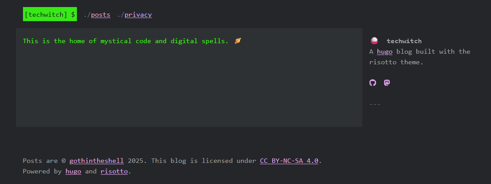

+++
title = 'Getting Started'
date = '2025-06-27T21:54:22+01:00'
author = 'gothintheshell'
draft = false
+++

# Introduction

Welcome to the my Techwitch blog, a place for me to explore my creativity, have a bit of fun, and share my hobbies and explorations into different types of tech. 

I'll share a bit more of my own journey later on, but for now let's get started with how you can also start building your own blog using [Hugo]. Hugo is an open-source framework for building fast and flexible static websites.  

# Getting Started

As I'm also starting out, I felt a static website would be a good start as I don't need a lot of dynamic content and there were also a number of pre-built [themes] available, which save me having to create all the front-end HTML/CSS content for the site. 

For the initial setup of the blog, I followed the [Hugo Quick Start guide][quickstart]. 

As I dug through the Hugo documentation, I was looking for what I would need to get started. It's a bit of a process so take it one step at a time and you'll be fine. 

    <iframe src="https://giphy.com/embed/1GZmVKsn5hVKfwxdjx" width="480" height="480" style="" frameBorder="0" class="giphy-embed" allowFullScreen></iframe>

## Pre-requisites: 
1) If you don't have an integrated developer environment (IDE) or lightweight client in which to write your code, I recommend doing so. There are a number of options out there. **VS Code** is the most popular, according to the [Stack Overflow Developer Survey][survey] (2023). However, other popular options include: Intellij IDEA, Notepad++, Vim, PyCharm, etc.
2) Install a package manager, common package managers are `Homebrew` (MacOS) or `Chocolately` (Windows) but I’ve also used `pip` and `pipenv` (both for Python packages). Having a package manager will make the installation and management of the various packages you require later on *easier*.  Other package managers are of course available. 😸
    - In this case I installed [`Chocolately`][chocolately], as I’ve used it before. 
    - Regardless of package manager, for any package you want to download and install, **_you should check into the security and integrity of the package being downloaded_**, ensuring you’re installing what you think you’re installing and not introducing security vulnerabilities to your systems or your application. For this reason, I recommend only downloading from reputable and recognised package registries, such as PyPi, npm, NuGet, Terraform, etc. While this will reduce the risk, it will not completely eliminate it - but we can further discuss application security tooling in future posts! 
3) Install [Git]. It is needed for much of the functionality you need when working with Hugo (and more generally for tracking changes and version management in software development), please go to the Hugo docs for additional details. 
4) Install [Go], this is programming language Hugo is written in, so you will need this in order to work with Hugo.
5) Install [Dart Sass], it’s used as part of transpiling, or converting, Sass to CSS. As I already had Chocolately installed it was as easy as running `choco install sass` in an command prompt (cmd) and answering `Y` to whether I want to run the related install scripts. 

## Install Hugo 
> While I just installed the above pre-requisite packages I need from my command prompt, the Hugo install docs explicitly state not to use Command Prompt or Windows PowerShell. So before the next step, I opened up VS Code, started a new Terminal session (Terminal > New Terminal) and used powershell, though you can also use git bash, to run the remaining commands in the Hugo Quick Start tutorial. **_Whether or not you need to do this will depend on your operating system, so as always reference the Hugo docs if in doubt._** 

6) To install Hugo, again it is as easy as running `choco install hugo-extended` as I wanted to install the extended version. Here are a few reasons why you may want to use the [extended version]. Link is for Windows, but there are documents for installing on Linux, MacOS, and BSD derivatives. 

7) *(Optional)* I also chose to install [GitHub Desktop], as a graphical user interface (GUI) for Git and one I can use to easily connect with my GitHub.com account when I’m ready to push my local changes there. You can also choose to use `git` from the command line, so just choose which works best for you! 

## Additional files creation 
While I was at it, once the project was created and the files visible within VS Code (following the Hugo [quickstart guide][quickstart]), I created a short `README.md` and a [`.gitignore`][gitignore] file using a couple of GitHub’s examples for Go and Hugo for my repo, in following best practices. 
- The README.md normally provides a short description of your project, as well as any useful and relevant information that people may need or want to know about your repo, its purpose, and its use.  
- A .gitignore file is important to help ensure you are not committing any sensitive files to your repo. This is especially important if you sharing this repo publicly, such as on GitHub or GitLab, other source code managers are out there! 

## Next step: Installing a theme
While the tutorial docs utilise `Ananka`, I knew I wanted to use [`risotto`][risotto] 

> Before choosing how to install the theme, I also read a bit about the difference between running the theme as a [submodule] and as the maker of risotto recommends installing it directly vs as a submodule, due to “the difficulty of tracking a specific release” I downloaded it directly from [GitHub][risotto github] as a `.zip file` (Code > Local > Download ZIP) and extracted the files to my themes directory within my local project. (ex. `C:\Users\[username]\techwitch\themes`) and then followed the instructions to update my `hugo.toml` configuration file to utilise the new theme. 

**Note:** The first time by leaving `risotto-main` (the default name of the extracted folder) in place as a themes subdirectory, instead of changing it to `risotto`, I experienced compiling errors vs as I had set the theme in my `hugo.toml` as `theme = 'risotto'`, so make sure these two items match!

I made a few minor amendments to my `hugo.toml` file to add a custom theme template, my own social links, and the addition of a dedicated privacy policy page.  Then made sure to save any files I amended in VS Studio before running the `hugo server` command from within my terminal session. 

## Unexpected content on page
I tested it and YAY, it mostly looks good except why is there `$ echo $ LANG` near the bottom of my page?! 

A quick search of where this was found in the code base revealed this was being rendered as a part of displaying the current language, in 
`$ echo $LANG <b>{{ .LanguageName }}</b>`. As I didn't like the aesthetic of the display, I commented out the `.Page.AllTranslations` range block it was nested within, just in case I change my mind and want to bring it back later. 

It's a start! 

[Hugo]: https://gohugo.io/
[themes]: https://themes.gohugo.io/
[quickstart]: https://gohugo.io/getting-started/quick-start/
[survey]: https://survey.stackoverflow.co/2023/#technology
[chocolately]: https://docs.chocolatey.org/
[Git]: https://git-scm.com/
[Go]: https://go.dev/
[Dart Sass]: https://gohugo.io/functions/css/sass/#dart-sass
[extended version]: https://gohugo.io/installation/windows/#editions
[GitHub Desktop]: https://desktop.github.com/
[gitignore]: https://docs.github.com/en/get-started/getting-started-with-git/ignoring-files
[risotto]: https://themes.gohugo.io/themes/risotto/
[submodule]: https://git-scm.com/book/en/v2/Git-Tools-Submodules
[risotto github]: https://github.com/joeroe/risotto
[example config]: https://github.com/joeroe/risotto/blob/main/exampleSite/config.toml