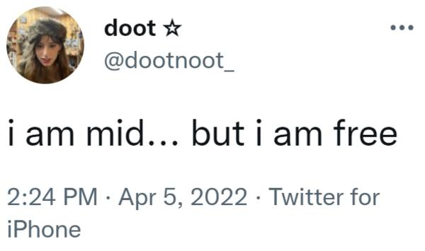

+++
title = 'Adventures in Engineering: Embracing Being Mediocre'
date = '2025-07-04T20:48:52+01:00'
author = 'gothintheshell'
draft = false
+++

The combination of the advent of half-yearly feedback cycles and realising that I’ve now been in my first engineering role for just over six months now created the spark for this particular post. 

A summary of some of the feedback I received from a senior engineer on our team was that I avoid one of the common pitfalls for developers of, “feeling too protective of their code and becoming defensive.” Pointing out that instead I seek out to understand the feedback and see how it can improve the code, and my own knowledge and skills, while still being confident enough to push back when I feel a suggestion is flawed or over-engineered. 

As a rejection-sensitive, perfectionist this feedback had me glowing (and nearly crying.) However, it did make me think about what makes this scenario different. 

    <iframe src="https://giphy.com/embed/3o6wrjfn5j5rqRKhIQ" width="480" height="480" style="" frameBorder="0" class="giphy-embed" allowFullScreen></iframe>

## Factors

I do think there are a few factors which play into this: 
- **Embracing the unknown:** I moved into an area where I knew I wouldn't be a Subject Matter Expert (SME). ***You've got to be willing to start somewhere.*** In previous InfoSec roles I put a lot of pressure on myself to become a SME as quickly as possible and I no longer feel the risk of burn out is worth it. So I'm:
    - Still learning how to code things in my first programming language (Python)
    - Feeling the freedom to make mistakes, so I'm not precious about it which brings me to my next factor;
- **Continuous learning mindset**: I’ve always been curious about what I don't know and embraced learning new things, which often includes learning from your mistakes. With writing code or working with new technology, this doesn’t change and in fact, I almost feel like it’s more often the case than not.
- **Supportive team environment:** I **cannot** underestimate the type of team environment I'm currently in, which has always been supportive. They encourage my curiousity and questions, and we are happy to openly share our knowledge and experience across the team. So we learn from one another, instead of competing with one another. 

## Conclusion

Being told your code will more often fail, than it succeeds, really fed into my fear of failure when I started out on my security engineering path and in taking this role, so I feel like somewhere along the line, my mindset ***has*** shifted. Maybe it’s setting that expectation for myself or maybe it’s knowing that you’ve got to make some mistakes to get better. Whatever it is, I’m grateful that it’s there and though I aspire to be a great engineer, right now I’m okay with being mediocre. 

