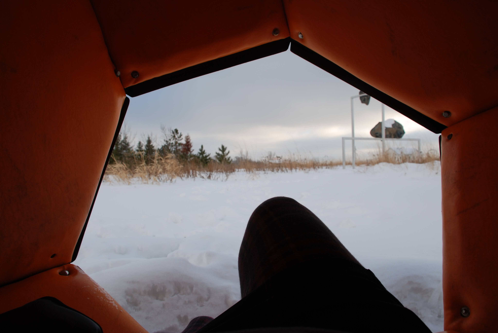

This is an digital art project focused on my favourite sculpture park, *[Franconia Sculpture Park](https://www.franconia.org)*. It's a magical place. ✨ 

I've been there numerous of times, 
in all four seasons, 
and if you have a special place in my life, I've probably taken you there. 😻

In attempting to view the artwork through a different lens or view, I've taken my own original images and modified them using image editing software to produce a new perspective. 

> *All sculptures are the respective artwork of the artists, the photos used and modified within this project are mine.*

Posts: 