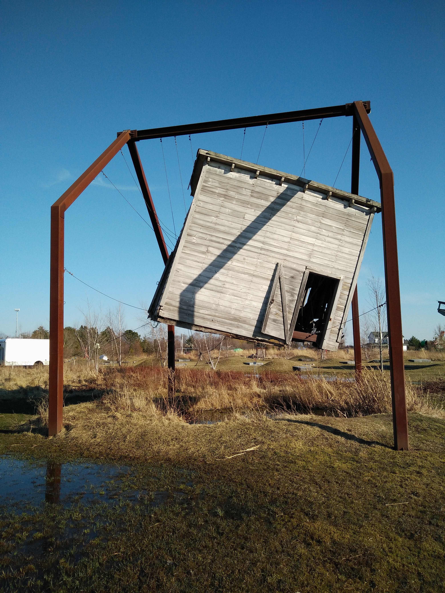

+++
date = '2026-02-25T20:10:56Z'
title = 'Floating Memories'
author = 'gothintheshell'
draft = false
+++

This artwork has its own place as a unique series within my memories, and a growing sense of grief and potential loss as I've watched it naturally decay over the years of visiting the park. 

Sculpture: Reclamation  
Artist: Melanie VanHouten  
For more info: https://www.franconia.org/melanie-vanhouten/