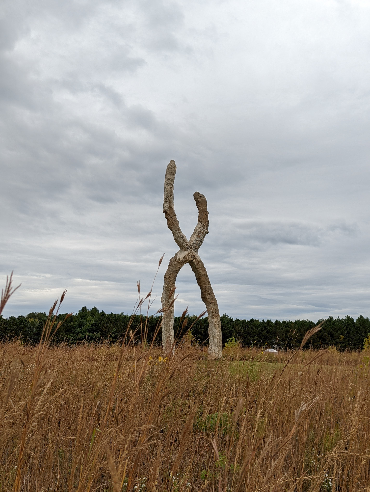

+++
date = '2025-07-13T19:54:11+01:00'
title = 'Mysterious skies'
author = 'gothintheshell'
draft = false
+++

Reaching into mysterious skies.

Sculpture: Skallagrim  
Artist: Peter Lundberg  
For more info: https://www.franconia.org/peter-lundberg/
