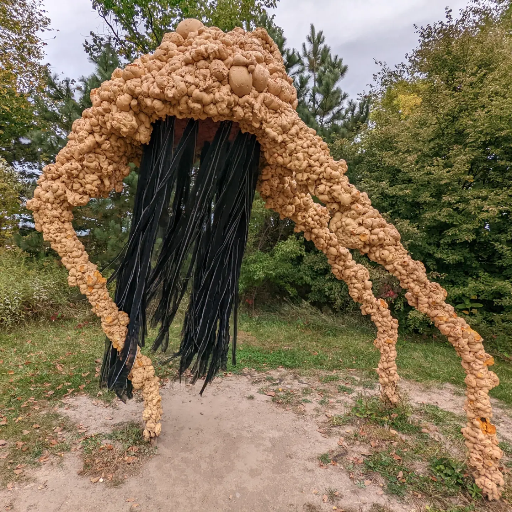

+++
date = '2025-07-11T23:09:39+01:00'
title = 'Pink Dancer'
author = 'gothintheshell'
draft = false
+++

Powerful in pink and possibly looking for a dance partner.🩷

Sculpture: The Pink Eyed Grazer  
Artist: Milan Warner @milan.warner  
For more info: [https://www.franconia.org/milan-warner/](https://www.franconia.org/milan-warner/)
